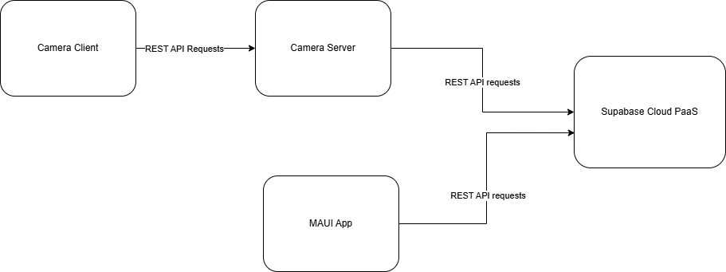

# LecIN
COMP602_Project

# Project structure:

High Level Diagram


## Frontend
- Maui App, connects to supabase backend
- Android, Windows supported
- End user application for students, lecturers, and admins

## Camera server 
- ASP.NET Core Web API, connects to supabase backend
- Packaged as docker image
- Handles Face uploads from camera clients
- Recognizes faces and marks attendance
- Centralized server to manage camera clients

## Camera client 
- Console application, connects to the camera server
- Packaged as docker image
- Detects faces and uploads to the camera server
- Each classroom will have one or more camera clients


# Development Environment Setup

1. Install dotnet 9 SDK from https://dotnet.microsoft.com/en-us/download/dotnet/9.0

2. Install Docker from https://www.docker.com/get-started

3. Install Supabase CLI from https://supabase.com/docs/guides/cli

4. Install Deno from https://docs.deno.com/runtime/getting_started/installation/

5. Clone and go into the repository:
   ```bash
   git clone https://github.com/HansithPerera/LecIN.git
   cd LecIN
   ```

6. Cd into the project directory:
   ```bash
   cd src
   ```

7. Restore the project dependencies:
   ```bash
   dotnet workload restore
   dotnet restore
   ```

# Running Tests

1. Start the Supabase local development environment:
   ```bash
   supabase start
   supabase functions serve
   ```
   or if you are using NPM:
   ```bash
   npx supabase start
   npx supabase functions serve
   ```
   
2. Test Database
    ```bash
    supabase db test
    ```
   
    or if you are using NPM:
    ```bash
    npx supabase db test
    ```
   
3. CD into Deno Edge functions directory:
   ```bash
   cd supabase/functions
   ```
   
4. Run Deno Edge function tests:
   ```bash
   cd supabase/functions
   deno test --allow-all
   ```
   
5. CD into the test project directory:
   ```bash
   cd ../../src
   ```
   
6. Run the Dotnet unit tests:
   ```bash
   dotnet test
   ```


# Running development environment

## Frontend (windows)

1. Start the Supabase local development environment:
   ```bash
   supabase start
   supabase functions serve
   ```
   or if you are using NPM:
   ```bash
   npx supabase start
   npx supabase functions serve
   ```
   
2. Open a new terminal and cd into the project directory:
   ```bash
   cd src/LecIN
   ```

3. Build the project:
   ```bash
   dotnet build
   ```
   
4. Run the project:
   ```bash
    & "./bin/Debug/net9.0-windows10.0.19041.0/win10-x64/Lecin.exe"
    ```

# Running production environment

## Frontend (windows)

1. Build the project:
   ```bash
   dotnet build -c Release
   ```
   
2. Run the project:
   ```bash
    & "./bin/Release/net9.0-windows10.0.19041.0/win10-x64/Lecin.exe"
    ```
